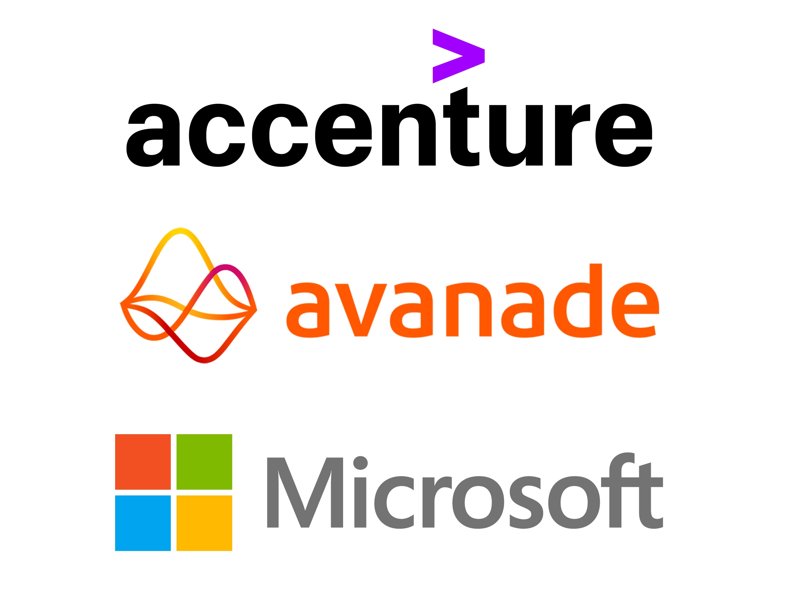

# Hi, I'm Jacob 👋
... an MSc Artificial Intelligence & Machine Learning Scholar with experience working in Avanade, Microsoft & Accenture AI teams. I specialise in Computer Vision, ML & Deep learning.

## 🙌 Achievements

  

- Working in Avanade, Microsoft & Accenture AI teams to develop Computer Vision models. I created an auto-segmentation algorithm which led to the opportunity to present findings to the UK&I AI teams at Avanade.
- Receiving a scholarship from the University of Birmingham as a result of deep learning personal projects & exceptional first-class results in BSc Mathematical Sciences at the University of Bath.
- Achieving 2nd place in worldwide Avanade FUEL hackathon, competing against colleagues across Data, Software & AI.
- Obtaining my TensorFlow Developer (Google) & Azure ML (Microsoft) Certifications.

## 📝 Research
My research focus is in Neural Rendering and I'm studying modules in Mathematics, Advanced Machine Learning, Deep Learning, Computer Vision & Natural Language Processing. You can follow my readings in my [ai_ml_research_papers repository](https://github.com/JacobShort11/ai_ml_research_papers).

## 👨‍💻 Code
I have experience using:
- TensorFlow
- PyTorch
- YOLOv8
- OpenCV
- Scikit-Learn

In my pinned repositories, you can find examples of my Deep Learning personal projects (Python) and my personal academic AI paper library, containing my notes exploring the underlying mathematics & code behind each paper.

<!--
**JacobShort11/JacobShort11** is a ✨ _special_ ✨ repository because its `README.md` (this file) appears on your GitHub profile.
